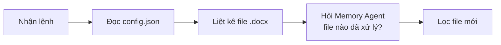
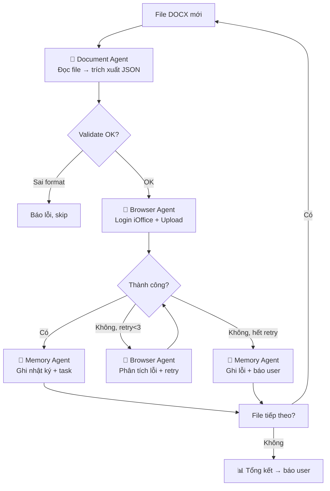

# 🧠 Orchestrator Workflow Guide
## Hướng dẫn cho Orchestrator Agent (default) khi xử lý iOffice

## LUỒNG XỬ LÝ CHÍNH

Khi user yêu cầu "Xử lý văn bản", tôi sẽ thực hiện:

### Phase 1: Chuẩn bị


### Phase 2: Xử lý từng file


### Phase 3: Kết thúc
- Tổng hợp kết quả
- Gửi báo cáo qua Telegram
- Hỏi user có muốn xử lý thêm không

## CÁC CÂU LỆNH GIAO TIẾP VỚI AGENT CON

### Gọi Document Agent
```json
{
  "to_agent": "ioffice-doc",
  "text": "Đọc file D:\\autooffice\\192\\QD_123.docx. 
           Trích xuất: số hiệu, ngày tháng, trích yếu, người ký, loại văn bản.
           Kiểm tra file đã xử lý trong memory/ioffice/processed/ chưa.
           Trả về JSON."
}
```

### Gọi Browser Agent
```json
{
  "to_agent": "ioffice-browser",
  "text": "Đăng nhập iOffice và upload file.
           File: D:\\autooffice\\192\\QD_123.docx
           Thông tin: {JSON từ Document Agent}
           Dùng kiến thức trong memory/ioffice/technical/ và knowledge/.
           Nếu form thay đổi → dùng Gemini vision phân tích.
           Ghi lại selector mới vào form-mappings.md.
           Trả về: {status, file, message}"
}
```

### Gọi Memory Agent
```json
// Khi xử lý xong
{
  "to_agent": "ioffice-memory",
  "text": "Ghi nhật ký: đã xử lý QD_123.docx.
           Kết quả: ✅ success.
           Model dùng: gemini-3-flash-preview.
           Cập nhật processed database.
           Tạo task nhắc: Kiểm tra văn bản đã được phê duyệt chưa, 
           deadline: 2026-05-18, priority: trung_bình."
}

// Khi user hỏi lịch sử
{
  "to_agent": "ioffice-memory",
  "text": "User hỏi: 'Hôm qua xử lý được bao nhiêu file?'
           Tra cứu journal/2026-05-10.md và trả lời."
}
```

## QUẢN LÝ MODEL THÔNG MINH

```python
# Logic chọn model trong đầu tôi:
if task == "vision" or task == "docx":
    model = "flash"  # gemini-3-flash-preview
elif task == "quick_action":
    model = "flash-lite"  # gemini-3.1-flash-lite-preview
elif task == "complex_reasoning":
    model = "pro"  # gemini-3.1-pro-preview
elif task == "fallback":
    model = "gemini-2.5-flash"
```

## QUẢN LÝ CRON JOBS

Khi cần tạo lịch tự động, tôi dùng cron skill:

```bash
# Kiểm tra hàng ngày lúc 8h
qwenpaw cron create \
  --agent-id default \
  --type agent \
  --name "ioffice-daily-check" \
  --cron "0 8 * * 1-6" \
  --channel telegram \
  --target-user "<TELEGRAM_USER_ID>" \
  --target-session "telegram:<TELEGRAM_USER_ID>" \
  --text "Kiểm tra thư mục D:\\autooffice\\192 có file DOCX mới không. Nếu có, bắt đầu xử lý."

# Báo cáo cuối ngày lúc 17:30
qwenpaw cron create \
  --agent-id default \
  --type agent \
  --name "ioffice-daily-report" \
  --cron "30 17 * * 1-6" \
  --channel telegram \
  --target-user "<TELEGRAM_USER_ID>" \
  --target-session "telegram:<TELEGRAM_USER_ID>" \
  --text "Tổng kết công việc hôm nay. Đọc journal hôm nay và báo cáo."
```

## XỬ LÝ LỖI

Khi agent con trả về lỗi:
1. Đọc error-patterns.md để tìm cách xử lý đã biết
2. Nếu có pattern → áp dụng
3. Nếu không → gửi cho Browser Agent với model pro để phân tích
4. Nếu vẫn lỗi → ghi vào error-patterns.md + báo user

## NGUYÊN TẮC CHUNG

1. **LUÔN kiểm tra** file đã xử lý trước khi làm (tránh trùng)
2. **LUÔN ghi log** sau mỗi thao tác
3. **LUÔN kiểm tra quota** Gemini trước khi chạy batch lớn
4. **KHÔNG spam** agent con - gộp nhiều việc vào 1 message nếu có thể
5. **BÁO CÁO** cho user sau mỗi batch (thành công, lỗi, thống kê)
6. **HỌC HỎI** từ lỗi → cập nhật knowledge base
